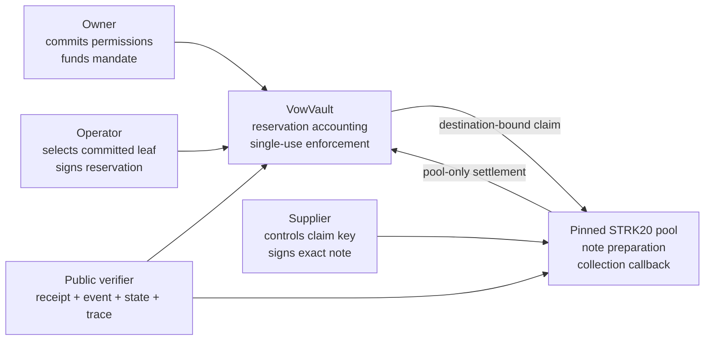

<div align="center">

# VOW

[](LICENSE)


### Confidential procurement permissions. Exact supplier settlement. No treasury key handoff.

VOW is a delegated-procurement protocol for STRK20. An owner commits a private set of one-use purchase permissions, an operator reserves only an approved purchase, and the supplier independently collects into the exact signed STRK20 note.

**[Demo video (placeholder) ↗](https://example.com/vow-demo)** · **[Live app (placeholder) ↗](https://example.com/vow-live)** · **[Five-minute judge path](JUDGES.md)** · **[Reproduce the evidence](REPRODUCE.md)**

Built for the STRK20 privacy track on Starknet.

</div>

---

## Demo

The intended walkthrough covers the complete separation of duties:

1. An owner builds a permission set locally, previews what will become public, and commits only its root.
2. An operator unlocks that committed set and reserves one approved purchase without receiving the supplier key.
3. A supplier reviews the exact destination-bound claim and signs it in an isolated local tool.
4. Anyone verifies the resulting public receipt without connecting a wallet.

Video: **[three-minute walkthrough (placeholder)](https://example.com/vow-demo)**

Hosted product: **[public deployment (placeholder)](https://example.com/vow-live)**

Until those links are replaced, run the reviewer path locally with `npm run app` and follow [JUDGES.md](JUDGES.md). The live mainnet contract and open reservation are real; a qualifying supplier collection is not yet claimed.

## Table of contents

- [The problem](#the-problem)
- [What VOW is](#what-vow-is)
- [Verify it yourself](#verify-it-yourself)
- [What is live and what is not](#what-is-live-and-what-is-not)
- [Architecture](#architecture)
- [Protocol invariants](#protocol-invariants)
- [The procurement flow](#the-procurement-flow)
- [Product surfaces](#product-surfaces)
- [Public and private data](#public-and-private-data)
- [Mainnet evidence](#mainnet-evidence)
- [Technology and project layout](#technology-and-project-layout)
- [Run it locally](#run-it-locally)
- [Tests and release reproduction](#tests-and-release-reproduction)
- [Known limitations](#known-limitations)
- [Documentation](#documentation)

## The problem

Delegated purchasing usually forces a bad choice. Give an operator broad control over a treasury, or require the owner to approve every purchase. Publishing an allowlist on chain avoids key handoff, but reveals suppliers and planned purchases before they are used.

VOW separates authority instead:

- The **owner** controls the budget and approves a bounded set of possible purchases.
- The **operator** can select only one committed permission and cannot redirect its supplier or raise its cap.
- The **supplier** controls the destination note and signs the exact collection claim.
- The **pool** is the only party allowed to settle a reservation after accepting that note.

Unused permissions remain unpublished. Once a permission is exercised, its supplier pseudonym, amount and timing become public protocol data.

## What VOW is

VOW combines a Cairo vault, a typed TypeScript SDK, isolated local role interfaces, strict transaction review, and a public evidence ledger.

<div align="center">

**`COMMIT → FUND → RESERVE → SIGN → COLLECT → VERIFY`**

</div>

The current implementation contains two contract layers:

- **`CollectionProbe`** is a deliberately narrow compatibility experiment: one owner-funded reservation, one supplier claim key, one pinned token and pool, and fixed identifiers. It is not the full product.
- **`VowVault`** is the protocol layer: isolated mandates, committed permission membership, operator-bound reservation, explicit Funded/Available/Reserved/Paid/Reclaimed accounting, revocation, recovery, single-use permissions and pool-only collection.

Neither contract exposes an upgrade path, generic external call, public supplier payout, admin sweep or root replacement.

## Verify it yourself

From a clean checkout using the required Node version:

```sh
npm ci --ignore-scripts
npm run check
sh scripts/cairo.sh test
npm run evidence:verify
```

Then compare the locally built vault with the deployed mainnet class and exact ABI allowlist:

```sh
npm run verify:vault
```

For the release-blocking clean-clone check:

```sh
npm run ci:clean
```

That command clones committed `HEAD` into a temporary directory, installs pinned root dependencies, builds the TypeScript and Cairo workbench, runs the Cairo and SDK suites, and verifies the public evidence ledger. Full prerequisites and checksum-pinned Cairo bootstrap details are in [REPRODUCE.md](REPRODUCE.md).

## What is live and what is not

| Capability | Current evidence | Claim boundary |
|---|---|---|
| Matching VowVault class | Declared and deployed on Starknet mainnet | Local and deployed class hashes match through one public RPC provider |
| Controlled mandate | Created with 0.1 STRK principal | Creation is not supplier settlement |
| Funding | Atomic approval and funding accepted | Funded principal is not a protocol fee |
| Reservation | Fully reserved; Paid and Reclaimed remain zero | Open reservation is not a payment |
| Supplier collection | No qualifying VOW collection recorded | Note credit, wallet compatibility and collection success remain unproven |
| Release gates | 0 of 5 pass | Deployment alone does not satisfy the first gate |
| Audit | None | Tests and ABI checks are not an audit |

The Ready wallet advertised Wallet API 0.10.3 and returned a prepared action list. VOW rejected the observed response before supplier signing or submission because the decoder required an optional screening suffix that the response omitted. The compatibility patch is covered locally, but no successful collection is inferred from that response.

## Architecture



Authority does not collapse into one browser or one key:

- Owner permission construction and backup happen locally.
- Operator reservation never accepts a supplier signing key, token override or deadline override.
- Supplier key generation, encrypted backup, restoration and claim signing run on a separate loopback origin with no wallet discovery.
- Public verification needs no wallet and treats missing or timed-out RPC facts as unknown.

## Protocol invariants

| Invariant | Enforcement |
|---|---|
| Exact destination binding | The supplier signature covers chain, vault, reservation, pool, token, amount, note ID and deadline |
| Committed permission membership | Reservation requires a valid proof for the owner’s padded permission root |
| No operator widening | The signature is bound to the mandate, permission, amount, supplier and request |
| No overspend | Reservation is limited by both the committed cap and currently available budget |
| Single use | A consumed permission cannot be reserved again, including after expiry |
| Reservation accounting | Funded, Available, Reserved, Paid and Reclaimed are tracked separately |
| Pool-only collection | Direct supplier and outsider settlement calls are rejected |
| Safe recovery | The owner cannot reclaim value still backing an open reservation |
| Unknown is not retryable | Timeout or missing receipt remains unresolved until reconciliation |
| No arbitrary authority | The ABI allowlist rejects generic calls, upgrades, sweeps and root replacement |

The Cairo suite runs the contract logic against synthetic token and pool contracts. Those negatives demonstrate local enforcement; they are not mined mainnet reverts.

## The procurement flow

### 1. Commit

The owner creates a padded 16-slot permission set. Each leaf binds a supplier pseudonym, maximum amount and nonce. Only the commitment root is stored on chain until a permission is selected.

### 2. Fund

The owner funds a mandate through an exact token approval and vault funding call. Direct token transfers are not counted as budget and cannot be swept back out.

### 3. Reserve

The operator opens the committed set locally, proves the selected leaf against the on-chain root and signs a reservation request. The vault checks the proof, signature, cap, deadline, replay state and available amount before moving value from Available to Reserved.

### 4. Sign

The supplier reviews the exact prepared note claim in the isolated supplier tool. A supplier key is usable only after its encrypted backup has been downloaded and successfully restored. Signing returns public signature values; the private key remains local.

### 5. Collect

The wallet prepares one exact call to the pinned STRK20 pool. The collection path is enabled only after fresh contract checks, exact action decoding, supplier signature verification, a bounded review window and a matching budget manifest. A timeout creates an unresolved attempt, not permission to retry.

### 6. Verify

The logged-out verifier checks the accepted transaction, exact VowVault event, pool deposit, claimed reservation state and token-pull trace. Contradictory facts are mismatches. Missing receipt, block, class, state or trace facts remain unknown.

## Product surfaces

Run `npm run app` to serve the VowVault product on `http://127.0.0.1:4319`.

| Route | Reviewer action |
|---|---|
| `/` | Read the protocol summary, deployment status and evidence links |
| `/owner` | Build permissions locally, preview disclosure, prove backup restoration and review mandate accounting |
| `/operator` | Unlock the committed set and reserve one leaf without supplier secrets or mutable settlement terms |
| `/claim/:reservationId` | Read live reservation state, prepare the exact STRK20 action and keep signing disabled on failed compatibility checks |
| `/verify` | Verify a public transaction without connecting a wallet |
| `/verify/:txHash` | Open the same verifier with a specific public transaction hash |

Additional isolated tools:

- `npm run supplier` serves the supplier-key tool on `http://127.0.0.1:4318`.
- `npm run diagnostic` serves wallet, activation, deployment and collection review routes on `http://127.0.0.1:4317`.
- `npm --prefix web run dev` serves the static presentation during development.

These loopback pages are reviewer and integration surfaces. They do not establish public hosting or mainnet collection.

## Public and private data

| Information | Visibility |
|---|---|
| Mandate owner, token, principal, deadline and commitment root | Public on chain |
| Selected permission, supplier pseudonym, reserved amount and timing | Public when reserved |
| Collection note ID, amount, helper and timing | Public if collection occurs |
| Unused permissions and supplier list | Not published by VOW |
| Supplier signing key | Local only; never requested through a URL or RPC call |
| Permission proof material | Used for authorization; excluded from public review and attempt journals |
| Recovery phrase and wallet credentials | Never requested or stored by the product |
| Confidential purchase details outside the permission fields | Outside the protocol and evidence files |

Note ownership privacy depends on the actual STRK20 wallet and pool flow. VOW has not yet demonstrated that property through a qualifying collection. See [PRIVACY.md](PRIVACY.md) for the complete disclosure boundary.

## Mainnet evidence

| Live deployment | Starknet mainnet value |
|---|---|
| VowVault | `0x641ca5237870312273ed2cd693372ee49e103d5c585af6185324f3662e15227` |
| Class hash | `0x3c85f692be0a2280bc85fc9802019121a8b52ef4de0db9273c3806f7355ce14` |
| STRK20 pool | `0x40337b1af3c663e86e333bab5a4b28da8d4652a15a69beee2b677776ffe812a` |
| Deployment account | `0x3f3cc7727c66634967621dc8d4697f1bfd6c29f81757496a4783bf5c90deb89` |

The evidence directory separates claims from observations:

- [evidence/claims.json](evidence/claims.json) is the public claim ledger and evidence-tier boundary.
- [evidence/vault-deployment-observation.json](evidence/vault-deployment-observation.json) records class declaration and deployment.
- [evidence/mandate-creation-receipt.json](evidence/mandate-creation-receipt.json), [evidence/mandate-funding-receipt.json](evidence/mandate-funding-receipt.json) and [evidence/reservation-receipt.json](evidence/reservation-receipt.json) record the controlled mandate path.
- [evidence/vault-abi-checks.json](evidence/vault-abi-checks.json) records the local/deployed class and entrypoint checks.
- [evidence/unrelated-receipt-observation.json](evidence/unrelated-receipt-observation.json) is a real successful mainnet transaction used as a negative control. It must be rejected as VOW collection evidence.

The deployment account paid 25.881484459600979024 STRK across activation, class declaration and vault deployment. Mandate creation, atomic funding and reservation paid another 0.470848776477080800 STRK in network fees. Supplier collection, wallet or prover charges, recovery reserve and the collection protocol-fee path remain unexecuted or unverified. These amounts are transcribed from the accepted receipts linked above; they are not estimates of a future collection.

## Technology and project layout

| Area | Technology | Location |
|---|---|---|
| Protocol contracts | Cairo, Scarb, Starknet Foundry | `contracts/` |
| Typed encoding and controllers | TypeScript, Starknet.js | `packages/vow-sdk/` |
| Product and role tools | TypeScript, HTML, CSS | `scripts/app/`, `scripts/supplier/`, `scripts/collection/` |
| Public presentation | Next.js, React, TypeScript | `web/` |
| Reproducible observations | JSON claim and evidence records | `evidence/` |
| Deployment manifest | Public chain, class and transaction references | `strk20.json` |

Small typed modules carry the protocol meaning. Token values use exact integer base units; chain, token, pool, wallet and class assumptions are pinned rather than inferred from defaults.

## Run it locally

Prerequisites are Node 24.14 or newer within major version 24, npm, Python, Git and curl. The bundled Cairo installer targets macOS Apple Silicon; other platforms must provide the pinned toolchain versions described in [REPRODUCE.md](REPRODUCE.md).

```sh
npm ci --ignore-scripts
python3 scripts/install-cairo.py
npm run app
```

Open `http://127.0.0.1:4319`.

For the presentation site:

```sh
npm --prefix web ci
npm --prefix web run dev
```

The presentation defaults its functional links to the local product origin. Set `NEXT_PUBLIC_VOW_APP_URL` only when the functional product is hosted elsewhere.

## Tests and release reproduction

| Command | What it checks |
|---|---|
| `npm run check` | TypeScript build, Cairo build, generated workbench and SDK/local-page tests |
| `sh scripts/cairo.sh test` | Cairo contract positives, negatives and cross-language vectors |
| `npm run evidence:verify` | Claim schema, JSON parsing, references, hashes, pool ABI digest and submission manifest |
| `npm run verify:vault` | Local class hash, deployed class hash, pool binding and exact ABI allowlist through one RPC provider |
| `npm --prefix web run check` | Presentation tests, lint, typecheck and static build |
| `npm run ci:clean` | Release-blocking T-020 against committed files in a temporary clean clone |

The recorded clean-clone gate passed against the final source and mainnet-evidence commit. Its documentation-only evidence refresh follows the tested commit, as explained in [REPRODUCE.md](REPRODUCE.md). Local passes do not turn an unresolved collection into a release-gate pass.

## Known limitations

- No qualifying destination-bound supplier collection has succeeded on the final VowVault deployment.
- The live STRK20 wallet, proof and note-credit path remains an unresolved integration dependency.
- Public hosting, an independent reproduction, the final video and submission links are not yet claimed.
- Mainnet reads and receipt verification use a single public RPC provider unless an evidence record says otherwise.
- The contracts and supplier backup implementation have not been audited.
- Tokens sent directly to the vault outside its funding entrypoint are neither accounted as mandate budget nor recoverable.
- Positive receipt and trace fixtures are synthetic; the unrelated accepted mainnet receipt is deliberately a negative control.

Release status remains **0 of 5 gates passed** until the requirements recorded in [evidence/claims.json](evidence/claims.json) are met.

## Documentation

- [JUDGES.md](JUDGES.md) — five-minute evaluation path
- [REPRODUCE.md](REPRODUCE.md) — clean-clone and manual reproduction
- [COMPATIBILITY.md](COMPATIBILITY.md) — wallet and STRK20 compatibility findings
- [THREAT_MODEL.md](THREAT_MODEL.md) — assets, adversaries and mitigations
- [PRIVACY.md](PRIVACY.md) — public/private boundary and secret handling
- [DECISIONS.md](DECISIONS.md) — protocol design decisions
- [evidence/claims.json](evidence/claims.json) — machine-readable claim ledger
- [LICENSE](LICENSE) — MIT license
